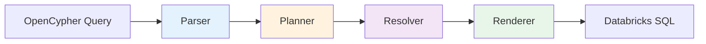

# gsql2rsql

**OpenCypher to Databricks SQL Transpiler**

Transform graph queries into high-performance SQL for Delta Lake.

---

> **Project Status**: This is a hobby/research project being developed towards production quality. While it handles complex queries and includes comprehensive tests (682+), it's not yet battle-tested at enterprise scale. **Contributions welcome!**

---

## What is gsql2rsql?

**gsql2rsql** transpiles [OpenCypher](https://opencypher.org/) graph queries to Databricks SQL, enabling graph analytics on Delta Lake without a dedicated graph database.

### Inspiration & Architecture


This project was inspired by Microsoft's [openCypherTranspiler](https://github.com/microsoft/openCypherTranspiler) (now **unmaintained**) which transpiled OpenCypher to T-SQL (SQL Server).

**Why a new transpiler?** Two reasons:

1. **Databricks SQL is fundamentally different** from T-SQL — WITH RECURSIVE, HOFs, and Delta Lake optimizations require different strategies
2. **Security-first architecture** — gsql2rsql uses strict [4-phase separation of concerns](docs/decision-log.md#decision-1-strict-4-phase-separation-of-concerns) for correctness:
   - **Parser**: Syntax only (no schema access)
   - **Planner**: Semantics only (builds logical operators)
   - **Resolver**: Validation only (schema checking, column resolution)
   - **Renderer**: Code generation only (**intentionally "dumb"** — no semantic decisions, just SQL generation)

This separation makes the transpiler **easier to audit, test, and trust**

**The game-changer**: Databricks recently added **WITH RECURSIVE** support, unlocking variable-length path traversal.

### Key Features

- ✅ **Variable-length paths** via `WITH RECURSIVE`
- ✅ **Comprehensive tests**: 682+ test cases with PySpark validation
- ✅ **Optimized SQL**: Filter pushdown, column pruning
- ✅ **Type-safe**: Schema validation and column resolution
- ✅ **Developer friendly**: Clear errors, CLI, TUI

---

## Quick Example

Transform this OpenCypher query:

```cypher
MATCH (p:Person)-[:KNOWS*1..3]-(friend:Person)-[:WORKS_AT]->(c:Company)
WHERE c.industry = 'Technology'
RETURN p.name, COUNT(DISTINCT friend) AS tech_connections
ORDER BY tech_connections DESC
LIMIT 10
```

Into optimized Databricks SQL with `WITH RECURSIVE` for path traversal!

[See the generated SQL →](examples/features.md#37-variable-length-paths-with-multi-hop-traversal-and-aggregation)

---

## Use Cases

- **[🔍 Fraud Detection](examples/fraud.md)** - Detect fraud rings and anomalies using graph pattern matching
- **[💳 Credit Risk Analysis](examples/credit.md)** - Analyze relationship-based credit risk
- **[🎯 Feature Engineering](examples/features.md)** - Graph features for ML models

See the [Examples Gallery](examples/index.md) for 69 complete query examples with generated SQL.

---

## Why Graph Queries on Delta Lake?


```
Delta Lake (Source) → CDC/ETL → (Graph) → Cypher → Results
```

**Problems**: Data duplication, sync lag, consistency issues, operational overhead, vendor lock-in

### Our Approach: Query Delta Directly

```
Delta Lake (Single Source) → OpenCypher (gsql2rsql) → Databricks SQL → Results
```

**Advantages**:
- **No duplication**: Query source data directly
- **Real-time**: Always fresh data
- **Cost-effective**: No second database
- **Unified governance**: Single data platform

---

## Billion-Scale Relationships

### The Problem with graph database at Scale

**10 billion edges** × 100 bytes/edge = DEATH

**graph databases Challenges**:
- Memory limits
- Vertical scaling only
- Enterprise licenses + large instances = $$$
- Long backup windows

### Triple Store in Delta Lake

```sql
CREATE TABLE relationships (
  subject_id STRING,
  predicate STRING,
  object_id STRING,
  properties MAP<STRING, STRING>,
  timestamp TIMESTAMP
) PARTITIONED BY (DATE(timestamp));
```

**Advantages**:
1. **Horizontal scale**: Petabytes, billions of rows
2. **Cost**: S3 storage ($0.023/GB) vs RAM ($10+/GB)
3. **Time travel**: Delta Lake versioning = free audit
4. **Z-ordering**: `OPTIMIZE ZORDER BY (subject_id, predicate)`
5. **Photon engine**: Vectorized execution


---

## LLMs + Transpilers: Enterprise Governance

**The Problem**: In enterprise environments, **someone must be accountable** for queries before execution — even with LLM text-to-query.

### Why Transpilers Matter

**1. Reviewability**: Graph queries are **4-5 lines** vs **hundreds of SQL lines**
```cypher
# 5 lines in Cypher
MATCH (c:Customer)-[:TRANSACTION*1..3]->(m:Merchant)
WHERE m.risk_score > 0.9
RETURN c.id, COUNT(*) AS risky_tx
ORDER BY risky_tx DESC
LIMIT 100
```
vs 150+ lines of recursive SQL. Easier for humans to review and approve.

---

## Installation

```bash
pip install gsql2rsql
```

Or install from source:

```bash
git clone https://github.com/devmessias/gsql2rsql
cd gsql2rsql/python
uv sync
uv pip install -e .
```

---

## Quick Start

**Example**: Find fraud networks using BFS (Breadth-First Search) up to depth 4, starting from a suspicious account and ignoring social relationships.

```python
from gsql2rsql.parser.opencypher_parser import OpenCypherParser
from gsql2rsql.planner.logical_plan import LogicalPlan
from gsql2rsql.renderer.sql_renderer import SQLRenderer
from gsql2rsql.common.schema import SimpleGraphSchemaProvider, NodeSchema, EdgeSchema, EntityProperty
from gsql2rsql.renderer.schema_provider import SimpleSQLSchemaProvider, SQLTableDescriptor

# 1. Define graph schema (for logical planner)
graph_schema = SimpleGraphSchemaProvider()

# Person node
person = NodeSchema(
    name="Person",
    properties=[
        EntityProperty(property_name="id", data_type=int),
        EntityProperty(property_name="name", data_type=str),
        EntityProperty(property_name="risk_score", data_type=float),
    ],
    node_id_property=EntityProperty(property_name="id", data_type=int)
)

graph_schema.add_node(person)

# Multiple edge types - we'll only query TRANSACAO_SUSPEITA
# AMIGOS and FAMILIARES are in the schema but ignored in the query
amigos = EdgeSchema(
    name="AMIGOS",
    source_node_id="Person",
    sink_node_id="Person",
    source_id_property=EntityProperty(property_name="person1_id", data_type=int),
    sink_id_property=EntityProperty(property_name="person2_id", data_type=int),
    properties=[]
)

familiares = EdgeSchema(
    name="FAMILIARES",
    source_node_id="Person",
    sink_node_id="Person",
    source_id_property=EntityProperty(property_name="person1_id", data_type=int),
    sink_id_property=EntityProperty(property_name="person2_id", data_type=int),
    properties=[]
)

transacao_suspeita = EdgeSchema(
    name="TRANSACAO_SUSPEITA",
    source_node_id="Person",
    sink_node_id="Person",
    source_id_property=EntityProperty(property_name="origem_id", data_type=int),
    sink_id_property=EntityProperty(property_name="destino_id", data_type=int),
    properties=[
        EntityProperty(property_name="valor", data_type=float),
        EntityProperty(property_name="timestamp", data_type=str),
    ]
)

graph_schema.add_edge(amigos)
graph_schema.add_edge(familiares)
graph_schema.add_edge(transacao_suspeita)

# 2. Define SQL schema (maps to Delta tables)
sql_schema = SimpleSQLSchemaProvider()

sql_schema.add_node(
    person,
    SQLTableDescriptor(
        table_name="fraud.person",  # Databricks catalog.schema.table
        node_id_columns=["id"],
    )
)

sql_schema.add_edge(
    amigos,
    SQLTableDescriptor(
        entity_id="Person@AMIGOS@Person",
        table_name="fraud.amigos",
    )
)

sql_schema.add_edge(
    familiares,
    SQLTableDescriptor(
        entity_id="Person@FAMILIARES@Person",
        table_name="fraud.familiares",
    )
)

sql_schema.add_edge(
    transacao_suspeita,
    SQLTableDescriptor(
        entity_id="Person@TRANSACAO_SUSPEITA@Person",
        table_name="fraud.transacao_suspeita",
    )
)

# 3. BFS Query: Find fraud network up to depth 4 from suspicious root account
# Only traverse TRANSACAO_SUSPEITA edges (ignore AMIGOS and FAMILIARES)
query = """
MATCH path = (origem:Person {id: 12345})-[:TRANSACAO_SUSPEITA*1..4]->(destino:Person)
RETURN
    origem.id AS origem_id,
    origem.name AS origem_name,
    destino.id AS destino_id,
    destino.name AS destino_name,
    destino.risk_score AS destino_risk_score,
    length(path) AS profundidade
ORDER BY profundidade, destino.risk_score DESC
LIMIT 100
"""

# 4. Transpile to SQL with WITH RECURSIVE (for BFS traversal)
parser = OpenCypherParser()
renderer = SQLRenderer(db_schema_provider=sql_schema)

ast = parser.parse(query)
plan = LogicalPlan.process_query_tree(ast, graph_schema)
plan.resolve(original_query=query)
sql = renderer.render_plan(plan)

print(sql)

# 5. Execute on Databricks
# df = spark.sql(sql)
# df.show(100, truncate=False)
```

**Output**: Databricks SQL with JOINs, WHERE filters, ORDER BY, and LIMIT — ready to execute on Delta Lake.

!!! tip "More Examples"
    See [Installation and Quick Start](installation.md) for detailed walkthrough, JSON schema format, and CLI usage.

---

## Documentation

| Section | Description |
|---------|-------------|
| **[Installation and Quick Start](installation.md)** | Get started with your first query |
| **[Examples Gallery](examples/index.md)** | Real-world fraud, credit, and feature queries |
| **[API Reference](api-reference.md)** | Python API and CLI documentation |
| **[Architecture](architecture.md)** | How the transpiler works |
| **[Contributing](contributing.md)** | Development guidelines |

---

## Architecture

gsql2rsql uses a **4-phase pipeline** for correctness and maintainability:



1. **Parser**: Cypher → AST (syntax only)
2. **Planner**: AST → Logical operators (semantics)
3. **Resolver**: Validate columns & types
4. **Renderer**: Operators → SQL

This separation ensures each phase has clear responsibilities and can be tested independently.

---

## Features

### ✅ Supported

- **MATCH** patterns with nodes and relationships
- **Variable-length paths** (`-[:REL*1..5]->`) via `WITH RECURSIVE`
- **WHERE** clause with complex predicates
- **WITH** for query chaining and aggregation
- **RETURN** with projections and aliases
- **Aggregations** (COUNT, SUM, AVG, COLLECT, etc.)
- **ORDER BY**, **LIMIT**, **SKIP**
- **DISTINCT** results
- **UNION** queries
- **CASE** expressions
- **Path functions** (length, nodes, relationships)
- **Undirected relationships** (`-[:REL]-`)
- **Filter pushdown** optimizations

### ⚠️ Limitations

- **Databricks Runtime 15+** required (for `WITH RECURSIVE`)
- **Deep paths** (>10 hops) may be slow
- **Write operations** not supported (`CREATE`, `DELETE`, `SET`)

See [Limitations](limitations.md) for details.

---

## Testing

Comprehensive test suite with 682+ tests:

```bash
# Unit tests (no dependencies)
make test-no-pyspark

# PySpark validation (dev only - requires PySpark)
make test-pyspark

# Specific category
make test-pyspark-fraud
```

**Note**: PySpark is only needed for development/testing. Users don't need it to use the transpiler.

All example queries are validated end-to-end on PySpark during development.

---

## Contributing

This is an **open hobby project** — contributions are very welcome!

- **Bugs**: [Open an issue](https://github.com/devmessias/gsql2rsql/issues)
- **Features**: [Discuss first](https://github.com/devmessias/gsql2rsql/discussions)
- **PRs**: Follow [conventional commits](contributing.md#commit-message-convention)

See [Contributing Guide](contributing.md) for:

- Development setup
- Testing requirements
- Separation of Concerns
- Code style guidelines

---

## License

MIT License - see [LICENSE](https://github.com/devmessias/gsql2rsql/blob/main/LICENSE) for details.

---

## Links

- **[GitHub Repository](https://github.com/devmessias/gsql2rsql)**
- **[Issue Tracker](https://github.com/devmessias/gsql2rsql/issues)**
- **[Examples Gallery](examples/index.md)**
- **[Decision Log](decision-log.md)**

---

**Ready to get started?** Check out the [Installation and Quick Start Guide](installation.md)!
