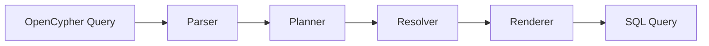

# Query Translation Guide

This guide explains how gsql2rsql transpiles OpenCypher queries to SQL.

---

## Overview

The transpilation process follows a four-phase pipeline:



Each phase has a specific responsibility and operates independently, maintaining strict Separation of Concerns (SoC).

---

## Phase 1: Parser

**Input:** OpenCypher query string
**Output:** Abstract Syntax Tree (AST)

The parser uses ANTLR4 with an OpenCypher grammar to convert the query string into a structured AST.

**Example:**

```cypher
MATCH (p:Person)-[:WORKS_AT]->(c:Company)
WHERE c.industry = 'Technology'
RETURN p.name, c.name
```

**AST Structure:**

```
MatchQuery
├─ MatchClause
│  └─ Pattern
│     └─ Path
│        ├─ Node(p, Person)
│        ├─ Edge(WORKS_AT, →)
│        └─ Node(c, Company)
├─ WhereClause
│  └─ Comparison(=)
│     ├─ Property(c.industry)
│     └─ Literal('Technology')
└─ ReturnClause
   ├─ Property(p.name)
   └─ Property(c.name)
```

**Key Components:**

- **Nodes**: Graph vertices with labels and variable bindings
- **Edges**: Graph edges with types and directionality
- **Patterns**: Combinations of nodes and edges
- **Clauses**: MATCH, WHERE, RETURN, WITH, ORDER BY, LIMIT, etc.
- **Expressions**: Property access, functions, operators, literals

---

## Phase 2: Planner

**Input:** AST
**Output:** Logical query plan (operator tree)

The planner converts the declarative AST into an imperative execution plan using relational operators.

**Operators:**

- `DataSourceOperator` - Read from a table
- `JoinOperator` - Join two data sources
- `FilterOperator` - Apply WHERE conditions
- `ProjectionOperator` - Select columns (RETURN clause)
- `AggregationOperator` - GROUP BY and aggregation functions
- `SortOperator` - ORDER BY
- `LimitOperator` - LIMIT clause
- `RecursiveTraversalOperator` - Variable-length paths (`-[:REL*1..N]-`)
- `UnionOperator` - UNION queries
- `SubqueryOperator` - Subqueries and WITH clauses

**Example Query Plan:**

For the query above:

```
ProjectionOperator [p.name, c.name]
└─ FilterOperator [c.industry = 'Technology']
   └─ JoinOperator [INNER]
      ├─ JoinOperator [INNER]
      │  ├─ DataSourceOperator [Person]
      │  └─ DataSourceOperator [PersonWorksAt]
      └─ DataSourceOperator [Company]
```

**Planning Strategy:**

1. **Pattern Decomposition**: Break MATCH patterns into node and edge components
2. **Join Planning**: Determine join order and conditions based on relationships
3. **Filter Pushdown**: Move WHERE conditions as close to data sources as possible
4. **Projection Planning**: Track which columns are needed at each stage

---

## Phase 3: Resolver

**Input:** Logical plan
**Output:** Resolved plan with column references

The resolver performs semantic analysis and column resolution:

1. **Schema Lookup**: Map node/edge labels to table names
2. **Column Resolution**: Resolve property references to table columns
3. **Type Checking**: Validate expression types
4. **Alias Generation**: Create unique column aliases to avoid conflicts
5. **Dependency Tracking**: Ensure required columns flow through operators

**Column Naming Convention:**

All columns are prefixed with `_gsql2rsql_` to avoid conflicts:

- `p.id` → `_gsql2rsql_p_id`
- `c.name` → `_gsql2rsql_c_name`
- `rel.since` → `_gsql2rsql_rel_since`

**Example Resolution:**

```cypher
MATCH (p:Person)
WHERE p.age > 30
RETURN p.name
```

Schema:
```json
{
  "nodes": [{
    "name": "Person",
    "tableName": "catalog.db.Person",
    "idProperty": {"name": "id", "type": "int"},
    "properties": [
      {"name": "name", "type": "string"},
      {"name": "age", "type": "int"}
    ]
  }]
}
```

Resolved References:
- `p` → `catalog.db.Person` table
- `p.age` → `catalog.db.Person.age` column → `_gsql2rsql_p_age`
- `p.name` → `catalog.db.Person.name` column → `_gsql2rsql_p_name`

---

## Phase 4: Renderer

**Input:** Resolved logical plan
**Output:** SQL query string

The renderer converts the logical plan into executable SQL.

**Rendering Strategy:**

1. **Bottom-Up Traversal**: Start from leaf operators (data sources)
2. **Subquery Generation**: Each operator generates a SQL fragment
3. **Column Tracking**: Maintain available columns at each level
4. **Join Rendering**: Generate INNER/LEFT/CROSS joins based on operator type
5. **Alias Management**: Create unique table aliases (`_left`, `_right`, `_proj`)

**Example Rendering:**

DataSourceOperator(Person):
```sql
SELECT
   id AS _gsql2rsql_p_id
  ,name AS _gsql2rsql_p_name
  ,age AS _gsql2rsql_p_age
FROM
  catalog.db.Person
```

FilterOperator(age > 30):
```sql
SELECT *
FROM (
  -- previous operator SQL
) AS _filter
WHERE (_gsql2rsql_p_age) > (30)
```

ProjectionOperator(p.name):
```sql
SELECT
  _gsql2rsql_p_name AS name
FROM (
  -- previous operator SQL
) AS _proj
```

---

## Pattern Translation

### Simple Match

**Cypher:**
```cypher
MATCH (p:Person)
RETURN p.name
```

**SQL:**
```sql
SELECT
  _gsql2rsql_p_name AS name
FROM (
  SELECT
     id AS _gsql2rsql_p_id
    ,name AS _gsql2rsql_p_name
  FROM
    catalog.db.Person
) AS _proj
```

### Relationship Traversal

**Cypher:**
```cypher
MATCH (p:Person)-[:WORKS_AT]->(c:Company)
RETURN p.name, c.name
```

**SQL:**
```sql
SELECT
   _gsql2rsql_p_name AS name
  ,_gsql2rsql_c_name AS name_2
FROM (
  SELECT
     _left._gsql2rsql_p_name
    ,_right._gsql2rsql_c_name
  FROM (
    SELECT
       _left._gsql2rsql_p_id
      ,_left._gsql2rsql_p_name
      ,_right._gsql2rsql__anon1_company_id
    FROM (
      SELECT id AS _gsql2rsql_p_id, name AS _gsql2rsql_p_name
      FROM catalog.db.Person
    ) AS _left
    INNER JOIN (
      SELECT person_id AS _gsql2rsql__anon1_person_id,
             company_id AS _gsql2rsql__anon1_company_id
      FROM catalog.db.PersonWorksAt
    ) AS _right
    ON (_left._gsql2rsql_p_id) = (_right._gsql2rsql__anon1_person_id)
  ) AS _left
  INNER JOIN (
    SELECT id AS _gsql2rsql_c_id, name AS _gsql2rsql_c_name
    FROM catalog.db.Company
  ) AS _right
  ON (_left._gsql2rsql__anon1_company_id) = (_right._gsql2rsql_c_id)
) AS _proj
```

### Variable-Length Paths

**Cypher:**
```cypher
MATCH (p:Person)-[:KNOWS*1..3]-(friend:Person)
RETURN p.name, friend.name
```

**SQL:**
```sql
WITH RECURSIVE _recursive_traversal AS (
  -- Base case: 1 hop
  SELECT
     source_id AS _gsql2rsql_start_id
    ,sink_id AS _gsql2rsql_end_id
    ,1 AS _gsql2rsql_depth
  FROM catalog.db.PersonKnows

  UNION ALL

  -- Recursive case: up to 3 hops
  SELECT
     rt._gsql2rsql_start_id
    ,edge.sink_id AS _gsql2rsql_end_id
    ,rt._gsql2rsql_depth + 1 AS _gsql2rsql_depth
  FROM _recursive_traversal rt
  INNER JOIN catalog.db.PersonKnows edge
    ON rt._gsql2rsql_end_id = edge.source_id
  WHERE rt._gsql2rsql_depth < 3
)
SELECT
   p.name AS name
  ,friend.name AS name_2
FROM catalog.db.Person p
INNER JOIN _recursive_traversal rt
  ON p.id = rt._gsql2rsql_start_id
INNER JOIN catalog.db.Person friend
  ON rt._gsql2rsql_end_id = friend.id
```

### Aggregation

**Cypher:**
```cypher
MATCH (p:Person)-[:WORKS_AT]->(c:Company)
RETURN c.name, COUNT(p) AS employee_count
ORDER BY employee_count DESC
```

**SQL:**
```sql
SELECT
   _gsql2rsql_c_name AS name
  ,_gsql2rsql_employee_count AS employee_count
FROM (
  SELECT
     _gsql2rsql_c_name
    ,COUNT(_gsql2rsql_p_id) AS _gsql2rsql_employee_count
  FROM (
    -- join query from previous example
  ) AS _agg_input
  GROUP BY _gsql2rsql_c_name
) AS _proj
ORDER BY _gsql2rsql_employee_count DESC
```

---

## Optimization Techniques

### 1. Filter Pushdown

Move WHERE conditions as close to data sources as possible to reduce intermediate data size.

**Before:**
```sql
SELECT * FROM (
  SELECT * FROM person p JOIN company c ON p.company_id = c.id
) WHERE c.industry = 'Technology'
```

**After:**
```sql
SELECT * FROM person p
JOIN (SELECT * FROM company WHERE industry = 'Technology') c
ON p.company_id = c.id
```

### 2. Column Pruning

Only select columns that are actually needed by downstream operators.

**Before:**
```sql
SELECT id, name, age, email FROM person
```

**After (only name is needed):**
```sql
SELECT id, name FROM person
```

### 3. Join Reordering

Order joins to minimize intermediate result sizes (currently basic heuristics; future: cost-based optimization).

### 4. Predicate Deduplication

Remove duplicate filter conditions that appear multiple times in the query.

---

## Limitations and Edge Cases

See [Limitations](limitations.md) for a complete list of unsupported features and known issues.

**Key Limitations:**

- **Undirected Relationships**: Cypher `-[:REL]-` requires UNION of both directions
- **Multiple Labels**: Cypher `(n:Label1:Label2)` not fully supported
- **Map Projections**: `RETURN {name: p.name, age: p.age}` not supported
- **List Comprehensions**: `[x IN list | x.property]` not supported
- **Pattern Comprehensions**: `[(a)-->(b) | b.name]` not supported

---

## Debugging Translation

### View Query Plan

Use the `explain` command to see the logical plan:

```bash
gsql2rsql explain --schema schema.json < query.cypher
```

### Enable Debug Logging

```bash
gsql2rsql translate --schema schema.json --debug < query.cypher
```

This shows:
- Parse tree structure
- Logical plan operators
- Column resolution details
- SQL generation steps

### Manual Inspection

Save generated SQL and inspect it:

```bash
gsql2rsql translate --schema schema.json < query.cypher > output.sql
cat output.sql | jq  # if SQL is formatted as JSON
```

---

## Best Practices

1. **Schema Design**: Use meaningful table and column names that reflect graph semantics
2. **Indexing**: Create indexes on ID columns used in joins for better performance
3. **Query Structure**: Break complex queries into WITH clauses for better readability
4. **Testing**: Validate generated SQL on a sample dataset before production use
5. **Monitoring**: Track query performance and optimize based on execution plans

---

## See Also

- [Architecture](architecture.md) - Detailed architecture documentation
- [CLI Commands](cli-commands.md) - Command reference
- [Examples](examples/index.md) - Real-world query examples
- [Decision Log](decision-log.md) - Design decisions and rationale
